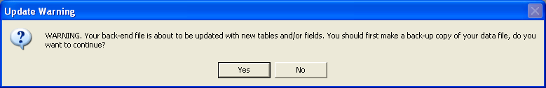
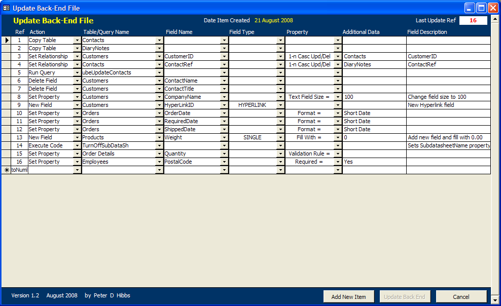
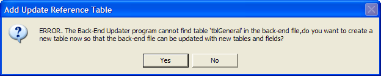

Introduction
============

This utility has been designed to be used by MS Access Developers to
update the back-end table schema of a client's database file
automatically from code within the front-end file. This allows the
developer to add or delete tables and/or fields in the back-end file
without having to visit the client in person. When any new facilities
are required which require changes to the tables you, the developer, can
just send a new front-end file to the client who will replace the
existing front-end file with the new version and then, when they first
run the program, the back-end updates are made automatically.

The update system works like this - a table, a code module and two forms
are imported into the front-end file. The table holds a list of updates,
i.e. new fields, new tables, etc, etc and the Update form is used to
enter data into the table. As the developer, you would open the form and
enter the details of any new field or table whenever you want to add a
field or table to the back-end. Click the **Update Back-end** button on
the form which then adds the new items to [your]{.underline} back-end
copy. When the modifications have been completed you can send the
front-end .mdb (or .mde) to your client and when he runs the program for
the first time the updates in the table are compared with the current
version (stored in the back-end) and if they don't match the latest
updates are automatically made to the client's back-end file. On a
multi-user system you should make sure that two users do NOT run the
program simultaneously as both PCs might try updating the back-end at
the same time.

This code has been tested on standard Access 2000/3/7 databases
(although it should work OK on other versions) and where all the tables
are stored in the same back-end file. If you need something more
complicated you will probably have to modify the code accordingly.

New additions to this code are marked like this : **New** in this
document.

Installation
============

To use this utility you will first need to create a field in the
back-end file which will be used to hold the current version number. If
you already have a table which has just one record (perhaps being used
to store information about the client) then you can add the new field to
this table, otherwise you will need to create a new table with the
version number field. The field name must be called **ubeVersion** and
be a **Number** type (Long Integer), the table can be called anything
you want. Make sure that initially the value in the field is set to 0.
You will need to do this on your own master back-end file as well as
your client's back-end file, of course. See also section **Add Reference
Table** below for a new facility to add this table automatically.

**Database Modifications**

To set up the update facility make the following changes to your
database program :-

1\. Run your database and import the following items into your front-end
file from the **ubeUtility V1-3.mdb** file provided with this document
:-

One table called **ubeUpdate**.

Two forms called **ubeForm** and **ubeUpdating**.

One module called **ubeUpdateCode.**

> If you want to use a short cut key to open the Update form and you
> have not already got an **AutoKeys** Macro you can also import the
> **AutoKeys** Macro from the .mdb file.

2\. Open the code module **ubeUpdateCode** and find the line near the
top of the page :-

Public Const gRefTable = \"tblGeneral"

> Change "tblGeneral" to the name of the single record table in the
> back-end file which holds the **ubeVersion** field. The global
> variable gRefTable holds the name of the table and is used in various
> locations in the **ubeUpdateCode** module. See also section **Add
> Reference Table** below for a new facility to add this table
> automatically.

3\. In the **Form\_Open** event of your **Start Up** form (i.e. the form
you have designated to open first in the **Startup** dialog form) enter
the following line of code :-

Call UpdateBackEndFile(False)

> If you have any code which automatically re-links the front-end to the
> back-end when you first run a new version, the Call
> UpdateBackEndFile(False) code should be placed [after]{.underline} it
> so that the tables are properly linked before the back-end updates are
> executed. See also **Re-Linking Front-end to Back-end** under the
> **Make Table** section below. If you are installing this code on
> Access 2007 using the new format (i.e. accdb) then see the section
> **Access 2007 Variations** below.

4\. Since the code uses various SQL functions you must also have a
reference to the DAO Object Library set. You will probably have this set
up already but if not, open the **References** form from the **Tools**
menu (while displaying VBA code) and tick the **Microsoft DAO 3.6 Object
Library** reference.

5\. It would be sensible to now Compile your code to ensure that you
have not imported any duplicate functions or procedures. Select
**Compile..** from the **Debug** menu in a VBA module.

Every time you or your client run the database the **UpdateBackEndFile**
function is called which then checks the current version number of the
back-end file (stored in the **ubeVersion** field of your table) and if
it is less than the latest version number stored in the **ubeUpdate**
table (stored in the front-end) the back-end updates are executed
automatically and then the version number field is updated. If no
updates are required no action is taken. The Boolean value passed to the
function indicates that the function is being called from the **Start
Up** form (i.e. False). If the function is called from the **ubeForm**
this value is set to True to indicate that the developer's version is
being updated.

Operation
=========

During the program development, to make a change to the back-end tables,
you should first open the **ubeForm** form. Note that this form has been
designed to work in a screen resolution of 1024 x 768 (or higher), if
you are using a smaller screen you will need to redesign the form layout
to fit. It does not matter what resolution screen your client uses, of
course, since they will not normally see this form.

Normally you would use this facility to add changes to the back-end file
after the database is up and running to save you having to visit the
client to make the changes manually. If you are starting a new database
from scratch (that is the client does not yet have a copy) you could
probably still use this system to modify the back-end file during the
development (assuming that you have split the database) since it would
be quicker and easier than opening the back-end file each time and
making the changes manually. I would suggest that if you do it this way
then when you are ready to deploy the database to your client, you
delete all the records from the **ubeUpdate** table, delete any
**ube...** tables that you may have created, delete any action queries,
etc and reset the **ubeVersion** field back to 0. This ensures that you
have a 'clean' front-end and back-end file for the client with no
temporary tables, queries, etc.

**Open Update Back End form with Short Cut keys**

You can open the form in the usual way by double clicking the form in
the database window or by using a keyboard short cut. I normally use the
CONTROL + SHIFT + Z short cut as my clients are unlikely to press this
key combination in normal use. To create a short cut first create a
Macro and name it **AutoKeys** (if you haven't already got one). Enter
\^+Z in the **Macro Name** column and select **OpenForm** in the
**Action** column. Then enter **ubeForm** in the **Form Name** property
field and save the Macro.

**Hide Update Form and Update Table**

If your client uses the .mdb version of the database you might want to
hide the form and table (you really don't want them to make any changes
to the stored data). To hide them right click on the form or table in
the database window and tick the **Attributes: Hidden** check box. Also
make sure that the **Hidden Objects** box is NOT ticked on the **View**
tab of the **Options** form.

**Data Entry**

When you open the update form you will see the form shown in Fig 3 below
(only with no entries initially, of course). To add a new item to the
list either click in the **Action** field of the last record or click
the **Add New Item** button. The **Ref** column will show the next
number in the sequence when you enter a value in the **Action** field.
The **Last Update Ref** field at the top of the form shows the current
version number of your back-end file and initially will be zero. When
you have entered the new table and/or field definitions (see later
sections for more details) click on the **Update Back-end** button and
your back-end file will be updated with the new data. While the update
is taking place a message box is displayed on screen as shown in Fig 1
below.

{width="2.875in"
height="1.0104166666666667in"}Usually this form will disappear very
quickly but if a Query or Procedure takes a long time to execute the
client (and you) will see that something is happening. Also the cursor
will change to an hourglass when a query runs (and you may want to do
this for any VBA code procedure as well).

**Fig 1.** Update in progress message form.

When the update has completed successfully a message will be displayed
at the bottom of the **Update** form -- **All Updates Completed OK**
(unless there was an error) and the **Last Update Ref** field will also
show the same number as the last record **Ref** column. Close the form
with the **Cancel** button and, when all your program changes are
complete, send the front-end file to your client.

The **Ref** field in the **ubeUpdate** table is an Incrementing
AutoNumber field and it is important that the value increments for each
new record (although it does not matter if there are any gaps in the
sequence). If there is any likelihood that this field may be converted
to a Random type AutoNumber field, (if the database is used for
replication, for example), then you will need to add some code to
provide a means to increment this value by one each time you add a new
record.

**Client Back-End Update**

When your client next runs the database program the changes you have
made to your back-end file (which are now stored in the **ubeUpdate**
table) will also be made in his back-end file from the
**UpdateBackEndFile** procedure called from the **Start Up** form. When
your client first opens the database and there are updates to be made, a
warning message is displayed as shown in Fig 2 below.

{width="6.125in" height="0.9895833333333334in"}

**Fig 2**. Warning message shown to client before updates.

If he clicks the **Yes** button the update procedure will execute as
normal, if he clicks **No** the database program will exit so that the
back-end file can be backed up using Windows or some other back up
application.

{width="6.75in" height="4.125in"}

**Fig 3**. Example of changing various fields and tables in the
**Northwind** database.

The example shown above adds two new tables and links them together in
the Northwind database, see the Northwind Database Tutorial below for
more details. The **Date Item Created** field will show the date each
record was created when you click on any field in a record.

Action Codes
============

There are 12 actions that can be selected from the drop down list in the
**Action** column. A brief description of each action is shown below.
Whenever an action is selected, any other columns which are required are
filled in with a brief description of what data should be entered into
those columns.

Note that you should fill in the columns from left to right because the
data entered into a column can affect other columns to the right of it.
The **Table/Query Name** column is a drop down box which will show a
list of local tables (i.e. tables in the front-end), linked tables (i.e.
tables in the back-end) or action queries depending on which option has
been chosen in the **Action** column. Note, however, that it is not
always possible to show the table name that you need. For example, if
you are adding a new table and then you need to add a new field to that
table on the next line, the table will not appear in the drop-down list
because it has not yet been added to the database. In these cases you
will need to enter the table name manually. Similarly, the **Field
Name** column drop down box will show a list of fields in the table that
you have selected in the **Table/Query Name** column, again if it is not
yet available you will need to enter it manually.

**Make Table**

This option allows you to create a table that has just one field, (you
can add more fields using the **New Field** action later). Enter the
name of the table in the **Table/Query Name** column, the name of the
field in the **Field Name** column and the type of field in the **Field
Type** column (selected from the drop down list provided). The field
types are the standard SQL names, see the **Field Types** section below
for further information.

You can also set a property for the field by selecting the appropriate
option from the **Property** drop down list (see also the **Set
Property** section below). As well as setting a property you can enter
some text in the **Field Description** column whenever a new field is
added to a table, although this is not a required column.

If your table requires any additional fields you can now add them using
the **New Field** action as described later.

**Re-Linking Front-end to Back-end**

One problem that may arise with creating new tables is if some sort of
automatic linking code is used to re-link the front-end file to the
back-end file when a new front-end is deployed to the client. If the
pathname for the back-end file is the same on the client's system as it
is on the developer's system then there should be no problem. However,
where the pathnames are different it is normal to automatically re-link
the front-end and back-end files when the new front-end is installed on
the client's system.

The problem is that when you, the developer, create a new table a link
is established to the table in your back-end file and the link pathname
is stored in the front-end file. When you send the front-end file to
your client and your automatic re-linking code runs, it will attempt to
link to the new table but the new table does not yet exist in the
back-end so an error 3011 would normally be generated. If this is the
case you will need to modify the re-linking code to ignore any 3011
errors when a table is missing. Once the update code runs, (which should
be immediately [after]{.underline} the re-linking code has finished),
the table will be created and will function normally.

Note that if you need to re-link the front-end to the back-end tables
there is code on the same Web site which will do that, see :-

<http://www.rogersaccesslibrary.com/forum/forum_posts.asp?TID=184>

**Copy Table**

The **Make Table** action above is suitable for small tables but can be
a bit cumbersome for large and complicated tables and cannot easily be
used for tables that already have data stored in them. The **Copy
Table** action allows more flexibility in creating new tables.

First you should create your new table in the front-end file with all
the required fields and field properties set up. If you also need the
table to contain data then enter the data. Now open the **ubeUpdate**
form, start a new record and select the **Copy Table** action. For this
option only the name of your table is required in the **Table/Query
Name** column. When you click the **Update Back-end** button the table
is copied to your back-end file and the original table in the front-end
is renamed with the prefix 'ube', for example a table called tblAccounts
will be renamed to ubetblAccounts. This table will remain in the
front-end file. When your client runs the database, the program will
copy the table ubetblAccounts to the client's back-end file and remove
the ube prefix at the same time.

If you need to copy a table that needs to be linked to another table in
the back-end you should copy the table first and then link the tables
with the **Set Relationship** action after the table has been copied to
the back-end. Do not try to copy a table/s that is linked in the
front-end.

**Remove Table**

To delete a table choose the **Remove Table** action, only the name of
the table to be deleted is required in the **Table/Query Name** column
for this option. Note that if the table has a relationship link to
another table you should delete the relationship first (see below).

**New Field**

To add a new field to an existing table select **New Field** in the
**Action** drop down list. Enter the name of the table in the
**Table/Query Name** column, the name of the new field in the **Field
Name** column and the type of field in the **Field Type** column. If you
need to change a property of the field choose the property in the
**Property** column drop down list (see below for more information) and
enter any additional data that may be required in the **Additional
Data** column (not all properties require extra data). You can also
enter a field description in the **Field Description** column if
required. Remember that any text that you enter in this column will
automatically be copied to the **Status Bar Text** property of the field
if you later add this field to a form.

When a Text or Memo field is added to a table manually in **Table Design
Mode** the **Unicode Compression** property is automatically set to Yes.
This utility will also set this property to Yes for Text and Memo
fields. If for some reason, however, you do not want this to happen you
should delete the appropriate line of code in the **NewFieldDefaults**
sub-routine.

Also for Text and Memo fields I prefer to set the **Allow Zero Length**
property to Yes for new fields. The reason being that when importing
data into a table using SQL or a DoCmd function the import can fail with
no warning if the property is set to No and the imported field has a
NULL value. If you want to have the property default to No then delete
the appropriate line of code in the **NewFieldDefaults** sub-routine.

Numeric fields such as Long Integer, Currency, etc normally default to 0
for new fields. Again this option is set in the **NewFieldDefaults**
sub-routine. If you want new numeric fields to default to Null then
remove the appropriate line of code.

**Delete Field**

To delete a field in an existing table select **Delete Field** in the
**Action** drop down list. Enter the name of the table in the
**Table/Query Name** column and the name of the field to be deleted in
the **Field Name** column. If the field is part of a Relationship join
you must delete the relationship first (see below). Also, if the field
is indexed you must remove the index first by using the **Index (No)**
property (see below).

**Change Type**

To change a field type in an existing table select **Change Type** in
the **Action** drop down list. Enter the name of the table in the
**Table/Query Name** column and the name of the field to be changed in
the **Field Name** column. Enter the new field type in the **Field
Type** column. Obviously you will need to be very careful with this
facility since you could lose data if the old and new field types are
not compatible. If the field is part of a Relationship join you must
delete the relationship first (see below). Also, if the field is indexed
you must remove the index first by using the **Index (No)** property
(see below).

**Set Property**

To change a field property select **Set Property** in the **Action**
drop down list. Enter the name of the table in the **Table/Query Name**
column and the name of the field to be changed in the **Field Name**
column. Select the property to be changed in the **Property** column, if
any other parameters are required a guide comment will be displayed in
the **Additional Data** column (although not all properties require
further data). A complete list of properties that can be changed are
shown below in the **Field** **Properties Selection** section.

**Set Relationship**

To create a relationship join between two tables select **Set
Relationship** in the **Action** drop down list. Enter the name of the
table that holds the primary key field in the **Table/Query Name**
column and the name of the link field for that table in the **Field
Name** column. Next, enter the type of relationship in the **Property**
column, note that this drop down box list is different for this
**Action** type. The relationship types available are as follows :-

**1 - 1 Not Enforced** One to One, Not Enforced

**1 - 1 Casc Updates** One to One, Cascade Update Related Fields

**1 - 1 Casc Deletes** One to One, Cascade Delete Related Records

**1 - 1 Casc Upd/Del** One to One, Cascade Update Related Fields and
Delete Related Records

**1 - n Not Enforced** One to Many, Not Enforced

**1 - n Casc Updates** One to Many, Cascade Update Related Fields

**1 - n Casc Deletes** One to Many, Cascade Delete Related Records

**1 - n Casc Upd/Del** One to Many, Cascade Update Related Fields and
Delete Related Records

Now enter the name of the table that holds the foreign key in the
**Additional Data** column and the name of the foreign key field in the
**Field Description** column. Note that the name allocated to a
relationship is a combination of the two table names (as Access normally
does).

The normal rules for relationships apply, of course, the primary key
must be unique (for 1 to many) and the field types must the same. Also
you need to bear in mind that the data in your back-end test file will
probably be different than that in your client's back-end file. This may
cause the relationship operation to fail if there is data in the foreign
table which does not match the data in the primary key table. You may
want to run some sort of test procedure first if this is a possibility,
see the **Run Query** and **Execute Code** options below.

**Clear Relationship**

To delete a relationship select **Clear Relationship** in the **Action**
drop down list. Enter the name of the table that holds the primary key
field in the **Table/Query Name** column and the name of the link field
in that table in the **Field Name** column. Next, enter the name of the
second table in the **Additional Data** column and the name of the
second field in that table in the **Field Description** column.

**Run Query**

There may be occasions where you need to add or change some data in the
client's tables when the back-end file is changed. To do this you can
design an Update query to make the necessary changes and then run the
query at start up along with any other table updates. First create the
Update query (I usually prefix it with 'ube' to easily identify it) and
test it on your own data. Then select **Run Query** in the **Action**
drop down list and enter the name of the query in the **Table/Query
Name** column. Bear in mind that when you come to update your own
back-end you will be running the query again so you may first want to
undo any changes you made during testing. Also see the **Fill With**
command below.

**Execute Code**

Although an Update query may be sufficient to do most update operations
there may be some times when a more complex operation is required. In
this case it may be necessary to run a VBA code procedure. You can do
this by writing the suitable code and storing it in a code module (it is
usually better to create a special Code Module just for this rather than
add the routines to an existing module as they will probably only ever
be executed once). When you have created the code and tested it select
**Execute Code** in the **Action** drop down list and enter the name of
the procedure in the **Table/Query Name** column. Bear in mind that when
you come to update your own back-end you will be running the code again
so you may first want to undo any changes you made during testing.

**Run Macro**

This option is basically the same as the previous section except that
you can use a Macro (although I think most Access Developers probably do
not use Macros).

Field Types
===========

There are 14 different field types that can be allocated for new fields.
A brief description of each one is shown below.

**AUTOINCREMENT** AutoNumber (Long Integer) *(Random AutoNumber is not
available).*

**TEXT** Text (255 characters max).

**DATETIME** Date and Time.

**BYTE** Byte (0-255).

**SHORT** Integer (-32,768 to 32,767).

**LONG** Long Integer (-2,147,483,648 to 2,147,483,647).

**SINGLE** Single FP (-3.402823E38 to -1.401298E-45 for negative values;
1.401298E-45 to 3.402823E38 for positive values).

**DOUBLE** Double FP (-1.79769313486231E308 to -4.94065645841247E-324
for negative values; 4.94065645841247E-324 to 1.79769313486232E308 for
positive values).

**CURRENCY** Currency (-922,337,203,685,477.5808 to
922,337,203,685,477.5807).

**YESNO** Yes/No (Boolean).

**MEMO** Text (64000 characters max).

**OLEOBJECT** OLE Objects.

**HYPERLINK** Hyperlink. **New**

**ATTACHMENT** File attachment (2007 only). **New**

Field Properties Selection
==========================

There are 20 options available under the **Property** column (although
not all are actual field properties) and some can also be used when
adding a new field. When you select a property the **Additional Data**
column will show a brief description of any additional parameters which
may be required.

**Text Field Size**

This sets the maximum **Field Size** of a Text field and should be
between 1 and 255 which is entered in the **Additional Data** column.
When a new field is added this property defaults to 255 so you only need
to change it if you need a smaller value.

**Format**

This option allows you to set the **Format** property for a field which
is entered in the **Additional Data** column.

**Caption Name New**

This option allows you to change a field's Caption name, the new caption
name should be entered in the **Additional Data** column.

**Decimal Places**

This option allows you to set the number of **Decimal Places** for some
numeric fields. A value between 1 and 15 should be entered in the
**Additional Data** column. *(Note that for some unknown reason this
option does not always seem to work and I don't know why, but then I
don't use it anyway as this can easily be done on the forms. If you can
fix it please let me know).*

**Input Mask**

This option allows you to set an **Input Mask** for a field and should
be entered in the **Additional Data** column.

**Default Value**

This option allows you to set the **Default Value** for a field and
should be entered in the **Additional Data** column (leave this column
blank if you want to remove an existing value). If you set this option
on a table that has existing records you may want to enter the default
value into the field for those records using the **Fill With** option
below.

**Validation Rule**

This option allows you to set a **Validation Rule** for a field and
should be entered in the **Additional Data** column. Also enter the
**Validation Text** (which is displayed when an error is generated by
Access) in the **Field Description** column. If the table already has
existing records you may first want to check that the current data does
not break the new validation rules.

**Required**

This option allows you to set the **Required** property for a field,
enter Yes or Y (or True if you prefer) in the **Additional Data**
column. If you enter anything else, the column will be set to No when
you leave the column.

**Allow Zero Len**

This option allows you to set the **Allow Zero Length** property to Yes
or No, enter Yes or Y (or True if you prefer) in the **Additional Data**
column. If you enter anything else, the column will be set to No when
you leave the column.

**New Field Name**

This option allows you to change the name of a field which should be
entered in the **Additional Data** column. However, this option should
only be used very carefully since changing the name of a field could
cause problems in your database.

**Ordinal Position**

This option allows you to change the **Ordinal Position** that the field
appears in the table. The number should be entered in the **Additional
Data** column. It appears that Access will not accept a value of 0 to
place a field in the first position so you should change the position of
the first field to a higher number first.

**Description**

This option allows you to set a **Description** for a field which you
see in table design mode and should be entered in the **Field
Description** column. Note that if you leave the default message in this
column it will be removed when you exit the record, this avoids having
your **Description** fields showing "(Field Description - Optional)" if
you forget to delete it yourself.

**Set Primary Key**

This option allows you to set a **Primary Key** for a field or group of
fields. If you want to set a single field as the primary key you should
leave the **Additional Data** column blank, the name in the **Field
Name** column will be set up as the first key field. If, however, you
want to have two or more fields to be primary keys you should enter the
extra field names in the **Additional Data** column separated by commas
and with no spaces before or after the commas. For example -- User
ID,User Name,User Type. The field entered in the **Field Name** column
will still be the first key field. The primary key field will be
allocated the name PrimaryKey as Access normally does. Note that if you
leave the reminder message in the **Additional Data** column it will be
removed when you exit the record, this avoids generating an error when
the program tries to index non-existent fields..

**Indexed (No)**

This option allows you to remove an **Index** for a field (including
primary keys), no other parameters are required.

**Indexed (Dup OK)**

This option allows you to set **Indexed Yes (Duplicates OK)** for a
field, no other parameters are required. The field name is allocated as
the Index name for this option.

**Indexed (No Dup)**

This option allows you to set **Indexed Yes (No Duplicates)** for a
field, no other parameters are required. The field name is allocated as
the Index name for this option. Obviously you must ensure that there are
no duplicate records in the client's table for this field before
changing this property.

**Set Compression**

This option sets the **Unicode Compression** property for Text and Memo
fields to Yes, no other parameters are required. Normally it would not
be needed since new fields default to Yes anyway. However you may need
to change it on some existing fields.

**Fill With**

This option is not actually a field property but it allows you to fill a
field for all records with a specific value. For example, suppose you
add a new currency field to a table and you set the **Default** property
to 0, you would probably want this field in any existing records to hold
the same value since any new records added to the table would set the
field to 0. You can also use it to populate an existing field with the
same value, note that only fields that are NULL will be filled. If you
want to fill all records regardless of what is currently present then
remove the WHERE criteria clause in the **FillField** procedure
(although I prefer to do this with an Update query, if required).

Enter the value in the **Additional Data** column, currency values
should be entered without any currency symbols. Date values should be
entered using the local date format (i.e. 10/2/2006). If a text string
is entered any embedded double quote characters are converted to two
single quote characters (you do not need to surround text with single or
double quotes).

**Rich Text New**

This option allows you to change a memo field into a Rich Text type
field (or back to a Plain Text type field). Enter Yes in the
**Additional Data** column to make the field Rich Text and No to make it
Plain Text. If you want to add a new field as a Rich Text field you
should set the field type to Memo and then add the Rich Text property.
Note that this will only work on Access 2007 that uses the new .accdb
type format and if you add a Memo field, with no property defined, it
will default to Plain Text.

**Smart Tags New**

This option allows you to add Smart Tags to any field that supports
them. You should enter the smart tag ID in the **Additional Data**
field. The easiest way to do this is to create a field with the
appropriate Smart Tags property and then copy and paste the Smart Tags
ID string into the Update table. Note that this will only work on Access
2007 that uses the new .accdb type format.

Add Reference Table New
=======================

When you first install the Update code in your database project you need
to add the ubeVersion field to a 'single record' table in the back-end
file. This is simple enough to do for a new project or if you have easy
access to your client's back-end file, you can just add a new table with
the ubeVersion field to your back-end file and your client's back-end
file, link the table to the front-end file and then use the Back End
Update code as described above.

However, you may have the situation where the database is already in use
and the client is at a location that is not easily accessible, perhaps
in another city or country. In this case you will need some method to
add the new table to his back-end file before you can use the update
code. This version includes code that allows you to do that.

First you should make sure that your back-end file is the same as his
back-end file (as far as the table design is concerned that is, the
actual data could be different, of course). Import the update table,
forms and module into your front-end file as described earlier. Open the
**ubeUpdateCode** module and find the following line of code near the
beginning of the module.

Public Const gRefTable = "tblGeneral"

Change the name of the table from "tblGeneral" to whatever table name
you prefer (or leave it as it is if you do not already have a table with
this name). Now open the ubeForm using the short-cut keys (or whatever
means you have chosen) and you will see the message shown below in **Fig
4**.

{width="5.333333333333333in"
height="1.0763888888888888in"}

**Fig 4.** Add new table to back-end file warning message.

If you click **No** the form will close with no changes made to your
database, if you click **Yes** the table you have named (i.e. tblGeneral
or whatever) will be added to your back-end file, linked to your
front-end file and a blank **Update Back-End** form displayed. Close
this form and confirm that you have a new table in the back-end file
with one field called **ubeVersion**. It would be advisable at this
stage to send your client a copy of the front-end and instruct him what
he should do. He should make a back-up copy of his front-end and
back-end files (which he should do anyway every time you send an update)
and then open the database as normal. When he runs the database for the
first time he will see the same message and he should then click the
**Yes** button, the **Update** **Back-End** form will not be displayed,
however. When he has confirmed that the database is working correctly
you can then start adding new tables/fields, etc to the project as
described above.

Remember that you can add new fields to this table for your own use but
you must NOT add another record to it.

Access 2007 Variations New
==========================

Using the **Back-End Update** code in Access 2007 is essentially the
same as any other version of Access except that the built-in Switchboard
form design is different when using the .accdb format. If you use the
wizard to create a switchboard form using this format the form does not
have any VBA code associated with it, it uses Macros to perform all the
functions instead.

To check for updates you can call the UpdateBackEndFile function from
the Switchboard form's **On Open** macro. To do this first design your
Switchboard form using the wizard as normal and then open the
Switchboard form in Design mode. The **On Open** event property should
show \[Embedded Macro\], click on the **...** button to display the
Macro dialog form similar to Fig 5 below.

{width="5.5in" height="2.622916666666667in"}

**Fig 5**. Typical Access 2007 'On Open' embedded Macro.

Click in the **Action** column on the next blank line and select Run
Code from the drop down, then in the **Function Name** field at the
bottom of the form enter "UpdateBackEndFile(False)" (without the
quotes). You could also enter some comments in the **Comment** column if
you want. Now click once on the record button for this line to highlight
it and then drag it up the list so that it is on the first line (to
ensure that it runs before any other actions). Save the Macro and exit.

If you are using any table re-linking code you should do the same but
make sure that the re-linking code runs [before]{.underline} the Update
Back-End code.

Upgrading from Version 1.1 New
==============================

If you have been using the previous version of this code and you are
upgrading to the newer version you will need to make the following
changes.

The table design of **ubeTable** has not been changed so any existing
update records will still work correctly. You will need to replace the
form, **ubeForm**, (form **ubeUpdating** has not been changed) and the
module, **ubeUpdateCode**, with the new versions. Obviously you will
then also need to change the **gRefTable** variable to the table name
that you are using as well as any other changes you may have made to the
code.

The only other change you may need to make is to the line of code that
calls the UpdateBackEndFile function in your start up code. The function
has been changed slightly as it now always returns True when called from
the start up code, this was changed to make it compatible with Access
2007 Macro use. As described in the **Installation** section above, you
can change it to call the function and ignore any value returned, if the
update should fail or the user cancels the update, the application now
quits [before]{.underline} the function returns. On the previous version
the application quits when a False value is returned, if you have
changed that code to do something else then you will need to rewrite
that part of the code accordingly.

Error Trapping
==============

Error trapping is a bit tricky in code like this because there are two
separate stages of operation. The first is when you update your own
back-end file during the development stage and the second is when your
client runs the update on his copy of the database.

If an error occurs the update operation immediately stops, an error
message is displayed and then the routine exits. If an error is detected
during the development stage, i.e. when you click the **Update
Back-end** button on the Update form, you will get an error message
dialog with the reference number of the line that failed displayed in
brackets.

If an error occurs when the code is run from your **Start Up** form the
application will quit immediately. Normally this would not happen for
you, the developer, because you will have fixed the problem before you
close down the database. For your client, however, it is probably
'restore from back up' time. If this does happen to you, you can easily
get back in to the database by using the Shift key on start up but this
is probably not an option for your client, especially if they are using
a .mde version.

The solution, of course, is to find and rectify any problems during
development so that the client does not have any problems when updating
the data.

One option you do have when errors occur is to wind back the version
number on your back-end file by changing the **Last Update Ref** field
to an earlier number and then running the update again. This works quite
well for changes to properties but not so much for new or deleted
objects. For example, if you add a new table which gets added to the
back-end but then fails because of a field property error (or whatever)
you cannot just go back and do it again as you will get another error
because the table already exists (unless you open the back-end file and
delete it manually first). You can use this facility, therefore, but use
it with care.

Disclaimer
==========

This is the usual disclaimer, I or the Web Site host do not take any
responsibility for any damage done to your or your client's database
files as a result of using this back-end update code. This is especially
important for this software because your client's back-end file is
probably invaluable to him and he won't take kindly if it is corrupted
by his own developer. For this reason the ONLY real safeguard is a
complete back up of the back-end file and the existing front-end file
before any updates are attempted. It may be possible to build into the
code some sort of automatic back up (for the back-end file at least),
although I haven't done so on this version because I have managed to
train my clients to back up everything before they make any updates to
their database files.

Acknowledgements
================

To the following experts for help with this project :-

> Getz, Litwin and Gilbert (for Access 2000 Developers Handbook).
>
> Dirk Goldgar and Allen Browne for help with Relationships code.
>
> Michael H for some useful VBA code.

Contact
=======

If you find any errors in this document or a bug in the code then please
send me a fix, (if possible).

If you have any suggestions for improvements which will benefit other
developers, please let me know, if it is just for your use then feel
free to change the code as you see fit.

My e-mail address is <pdh_software@btinternet.com>

Peter D Hibbs Ringwood, Dorset, United Kingdom.

History
=======

Version 1.0 1 September 2006.

Version 1.1 11 November 2006 Added code to set recordset and database to
Nothing on exit.

> Moved 'Updating' form code so it does not display unless actually
> updating tables.

Version 1.2 1 August 2008. Added Hyperlink type fields.

> Added Caption property.
>
> Added Rich Text property for memo fields (Access 2007).
>
> Added Smart Tags property (Access 2007).
>
> Added Attachment type field (Access 2007).
>
> Added facility to create reference table in BE automatically.
>
> Added tutorial using Northwind database.

Version 1.3 27 February 2010 Fixed bug in Fill With code that did not
fill Boolean fields

> correctly.
>
> Fixed bug that sometimes did not show entries on form in order of ID
> field.

Version 1.4 January 2018 Fixed bug that did not set Boolean fields
correctly.